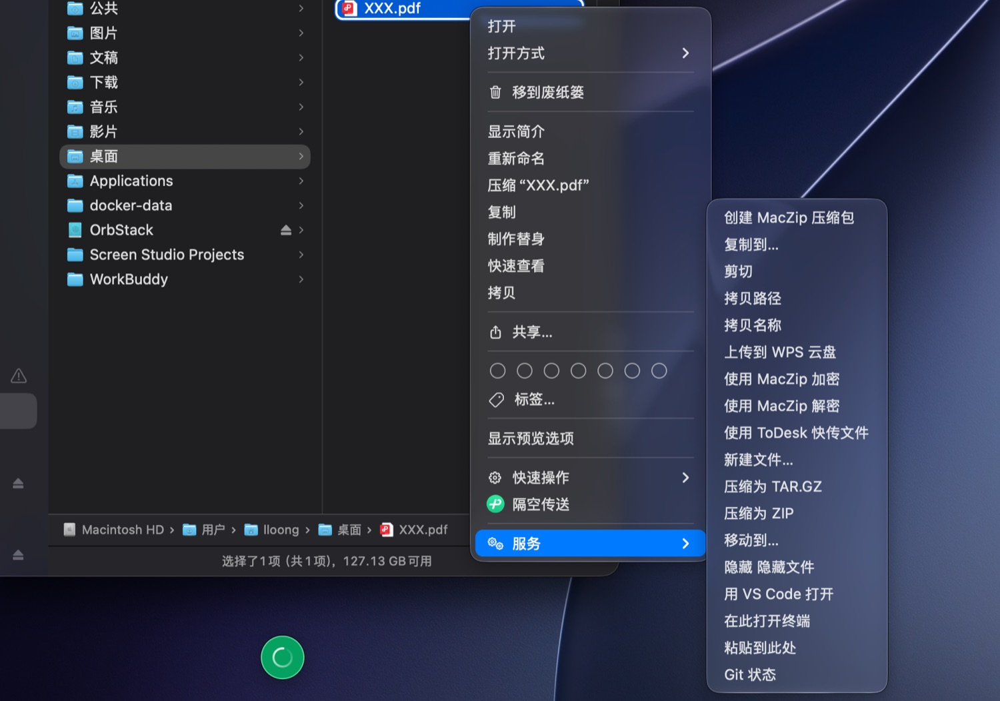

# FinderTools

给 macOS Finder 右键菜单加 13 个实用操作的小工具,装好即用。

<p align="center">
  
</p>

> 右键 → **服务**,就是上面这些。截图里的 MacZip、WPS、ToDesk 是其他软件的服务,
> 系统会把所有 App 的服务列在一起,互不影响。

## 功能

| 操作 | 说明 |
|---|---|
| 拷贝路径 | 完整路径,多选用换行分隔 |
| 拷贝名称 | 仅文件名 |
| 新建文件… | 弹窗输入文件名并选格式(txt / md / csv / json / html / xml),重名自动加 `-1` 后缀 |
| 压缩为 ZIP / TAR.GZ | ZIP 用 `ditto`,保留 macOS 扩展属性 |
| 复制到… / 移动到… | 弹出文件夹选择框 |
| 剪切 / 粘贴到此处 | 先标记,到目标文件夹再粘贴,补上 Finder 缺失的剪切 |
| Git 状态 | 仓库、分支、改动数,复制到剪贴板 |
| 在此打开终端 | 在当前目录打开 Terminal |
| 用 VS Code 打开 | — |
| 显示/隐藏 隐藏文件 | 切换后自动重启 Finder |

> 对**文件夹**右键,操作作用于该文件夹;对**文件**右键,操作作用于其所在目录(如新建文件)。

## 为什么选它

- **轻** —— 安装包不到 1 MB。它不是常驻软件:点右键时才被系统叫起来干活,干完 30 秒自动退出,不占菜单栏、不占内存、没有开机启动项
- **干净** —— 不申请任何权限。不需要「自动化」「辅助功能」授权,系统直接把选中的文件递给它
- **快** —— 剪贴板、弹窗、通知全走系统原生界面,拷贝路径即时生效
- macOS 13+,Apple Silicon / Intel 通用

## 安装

1. 从 [Releases](https://github.com/lloongwa/FinderTools/releases/latest) 下载 `FinderTools-x.x.x.dmg` 并打开
2. 把 **FinderTools.app** 拖进 **Applications**
3. **必做(只需一次)**:终端执行

```bash
xattr -dr com.apple.quarantine ~/Applications/FinderTools.app
```

> macOS 会给从网上下载的未公证 App 加「隔离」标记,不解除的话,右键操作会提示
> **「已损坏,无法打开」**——这是 Gatekeeper 的限制,不是安装失败。解除一次后永久有效。

装完即用。若右键菜单里没看到新操作,先执行 `killall Finder`。

## 常见问题

**右键菜单里没有这些操作?**

依次尝试:`killall Finder` → 注销重新登录 → 「系统设置 → 键盘 → 键盘快捷键 → 服务…」里勾选 FinderTools 相关项。

**卸载后右键菜单里还有残留?**

菜单有缓存,执行 `killall Finder` 即可刷新;或运行 `bash FinderTools/build.sh uninstall` 做彻底清理。

## 自己编译

只需要免费的 Xcode Command Line Tools:

```bash
xcode-select --install        # 仅首次需要
git clone https://github.com/lloongwa/FinderTools.git
cd FinderTools/FinderTools
bash build.sh install         # 编译 + 安装 + 刷新服务注册
```

不需要 Python、不需要完整 Xcode。其他命令:`bash build.sh selftest` 跑冒烟测试,`uninstall` 卸载,`dmg` 打安装包。

## 加一个自己的操作

1. `FinderTools/Info.plist` 的 `NSServices` 数组里加一项(菜单名 + 方法名)
2. `main.swift` 的 `ServiceProvider` 里加对应的 `@objc` 方法
3. `ItemAction` 里写逻辑,然后 `bash build.sh install`

## 许可证

[MIT](LICENSE)
